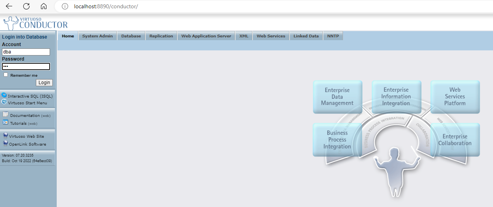

# Virtuoso & Skosmos

*Status: in progress*

This recipe presents steps to publish a code-lists using the [SKOS ontology](https://www.w3.org/2004/02/skos/) in Virtuoso and Skosmos. [Virtuoso](https://virtuoso.openlinksw.com) is an open source Triple store providing a SPARQL endpoint. 
[Skosmos](https:/skosmos.org) is an open source web application providing a human friendly browse interface for skos thesauri stored in a triple store.

This is a follow up recipe of the [extending code-lists recipe](./code-listsExtension.md).

In this recipe we're going to reproduce the publication of the `GLOSIS - Procedures` Codelist, maintained at [github](https://raw.githubusercontent.com/rapw3k/glosis/master/glosis_procedure.ttl), initiated by the former [SieuSoil project](https://www.sieusoil.eu/) with contributions from the [EJP Soil project](https://ejpsoil.eu).  

## Load SKOS RDF to virtuoso

We're using a docker compose orchestration to deploy virtuoso and skosmos locally. Copy the contents of the [virtuoso folder](https://github.com/ejpsoil/soildata-assimilation-guidance/blob/main/docker/virtuoso-skosmos) into an empty folder. Navigate to the folder with command line and run:

```
docker compose up
```

(ctrl-c to stop the containers)

- Open http://localhost:8090/conductor and login using user: dba, password: dba (the password is configured as part of the docker compose)



- On the `linked data` tab, select `Quad store upload`.
- Select `Resource URL` and past the [url of the ttl file](https://raw.githubusercontent.com/rapw3k/glosis/master/glosis_procedure.ttl) from github (or upload a local file)
- Select `create graph` and enter as graph uri `http://w3id.org/glosis/model/procedure#`, click `upload`.


- Navigate to http://localhost:8090/sparql/ and run a default sparql query `select distinct ?Concept where {[] a ?Concept} LIMIT 20`, the glosis concepts should be returned.

## Setup Skosmos

The file [config-docker.ttl](https://github.com/ejpsoil/soildata-assimilation-guidance/blob/main/docker/virtuoso-skosmos/config-docker.ttl) contains the configuration of SKOSMOS. The file is pre-configured for the procedures codelist, but you have to update it if you want to include alternative code lists. 

After an update of the config file, you need to restart the docker compose.

- Open http://localhost and evaluate if the codelist is properly loaded. 

In case of errors, logging of skosmos occurs in the `browser log panel`, click anywhere in the page and select `inspect` from the context menu. Then open the `console` tab and refresh the page.

In case you are insterested to update the look and feel of the skosmos instance, notice the `skosmos:customCss` property on the configfile. This property can link to a css file having custom css. Include the css file via a volume mount in the docker compose.

## Read more

Virtuoso

- Website: [virtuoso](https://virtuoso.openlinksw.com)
- GitHub: [github](https://github.com/openlink/virtuoso-opensource)
- Docker: [docker](https://hub.docker.com/r/openlink/virtuoso-opensource-7)
- Virtuoso at ISRIC: [isric](https://virtuoso.isric.org/)

Skosmos

- Website: [skosmos](https://skosmos.org)
- GitHub: [github](https://github.com/NatLibFi/Skosmos)
- Docker: [docker](https://hub.docker.com/r/ndslabs/skosmos)
- Skosmos examples: [glosis](https://glosis.isric.org), [agrovoc](https://agrovoc.fao.org), [agclass](https://agclass.nal.usda.gov)

