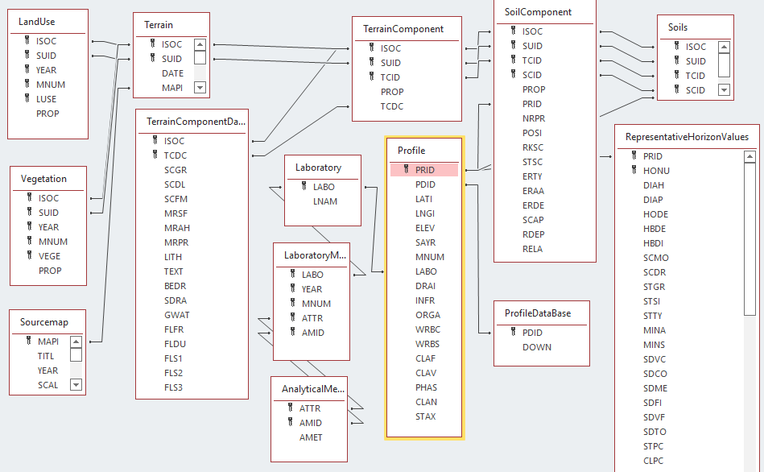
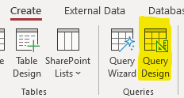
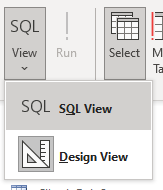
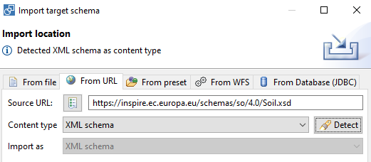
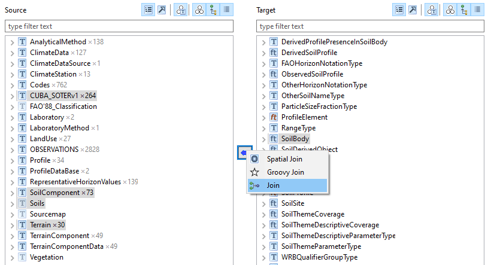

# HALE Studio

HALE Studio aims to enable users to set up a harmonization workflow on datasets from a local model to a common model, such as INSPIRE. The user interface presents the model of the source dataset (derived from database) on the left and the target model on the right (derived from xml schema). Conversion rules are defined by selecting similar properties on both sides.

The open source software has been developed in the scope of a European Research project, HUMBOLDT (2006) and is currently maintained by a company called [WeTransform](https://wetransform.to) in Darmstad Germany. WeTransform hosts the Hale Studio [user guide](http://help.halestudio.org/latest) and a [user forum](https://discuss.wetransform.to). The Git repository for Hale Studio is at https://github.com/halestudio/hale.

This cookbook has been developed in the scope of a Masterclass on data assimilation within the [EJP Soil project](https://ejpsoil.eu/) and builds on harmonization work performed in the scope of the [eDanube project](https://www.isric.org/projects/soil-and-terrain-database-danube-basin).

In this cookbook we'll harmonize a SOTER database to the INSPIRE model. Read more about the INSPIRE Soil model in the relevant [technical guidelines](https://inspire.ec.europa.eu/id/document/tg/so). 

Contents of the cookbook

- SOTER database
- Proparing the data 
- Install & get started with Hale Studio
- Define harmonization rules
- Export GML

## SOTER Database

For this cookbook we're going to use the SOTER database of Cuba. Download the zip file from https://data.isric.org/geonetwork/srv/eng/catalog.search#/metadata/f31ac19f-67a4-4f64-94cc-d4f063ea9add. 

The [SOTER programme](https://www.isric.org/explore/soter) was initiated in 1986 by the Food and Agricultural Organization of the United Nations (FAO), the United Nations Environmental Programme and ISRIC, under the auspices of the International Soil Science Society. The aim of the programme was to develop a global SOTER database at scale 1:1 million that was supposed to be the successor of the FAO-UNESCO Soil Map of the World. A SOTER database with global coverage was never achieved, but SOTER databases were developed for various regions, countries and continents.

The picture below shows the database structure of a SOTER database. The database structure allows to store terrain, soil profile up to wet chemistry results.



In this cookbook we're focussing on the `RepresentativeHorizonValues` table mostly, which contains observed properties for each horizon. 

## Preparing the data

Notice that, like many other soil databases, the observed soil property values are listed as columns for each horizon. The INSPIRE model instead uses the Observations and Measurments model, in which each observation is an individual entity which includes the feature of interest (e.g. `Horizon 2`), the observed property (e.g. `pH`), the result (e.g. `7.2`) and the process (e.g. `pHCaCl2`). 


A data transformation required for this step is challenging within Hale, but relatively easy within the database. So before starting up Hale we'll make an initial transformation within the database.

The [SOTER zip file](https://files.isric.org/public/soter/CU-SOTER.zip) contains a SQLite as well as a Access version of the database. In this cookbook we'll work with Access, but you can also use the SQLite version, in that case install for example [SQLite browser](https://sqlitebrowser.org/) to interact with the database. Some of the queries may slightly vary between SQLite and Access.

Run the query below, to create a new `OBSERVATIONS` table. 

In Access create a new `query` in `design view`. 



Then open `SQL view`.



Run the query, by clicking `Run` in the `Query design` toolbar.

```
SELECT * INTO OBSERVATIONS
FROM (Select HONU,PRID,'SCMO' as PARAM,SCMO as RESULT from RepresentativeHorizonValues where SCMO is not null union
Select HONU,PRID,'SCDR' as PARAM,SCDR as RESULT from RepresentativeHorizonValues where SCDR is not null union
Select HONU,PRID,'STGR' as PARAM,STGR as RESULT from RepresentativeHorizonValues where STGR is not null union
Select HONU,PRID,'STSI' as PARAM,STSI as RESULT from RepresentativeHorizonValues where STSI is not null union
Select HONU,PRID,'STTY' as PARAM,STTY as RESULT from RepresentativeHorizonValues where STTY is not null union
Select HONU,PRID,'SDVC' as PARAM,SDVC as RESULT from RepresentativeHorizonValues where SDVC is not null union
Select HONU,PRID,'SDCO' as PARAM,SDCO as RESULT from RepresentativeHorizonValues where SDCO is not null union
Select HONU,PRID,'SDME' as PARAM,SDME as RESULT from RepresentativeHorizonValues where SDME is not null union
Select HONU,PRID,'SDFI' as PARAM,SDFI as RESULT from RepresentativeHorizonValues where SDFI is not null union
Select HONU,PRID,'SDVF' as PARAM,SDVF as RESULT from RepresentativeHorizonValues where SDVF is not null union
Select HONU,PRID,'SDTO' as PARAM,SDTO as RESULT from RepresentativeHorizonValues where SDTO is not null union
Select HONU,PRID,'STPC' as PARAM,STPC as RESULT from RepresentativeHorizonValues where STPC is not null union
Select HONU,PRID,'CLPC' as PARAM,CLPC as RESULT from RepresentativeHorizonValues where CLPC is not null union
Select HONU,PRID,'PSCL' as PARAM,PSCL as RESULT from RepresentativeHorizonValues where PSCL is not null union
Select HONU,PRID,'BULK' as PARAM,BULK as RESULT from RepresentativeHorizonValues where BULK is not null union
Select HONU,PRID,'ELCO' as PARAM,ELCO as RESULT from RepresentativeHorizonValues where ELCO is not null union
Select HONU,PRID,'SSO4' as PARAM,SSO4 as RESULT from RepresentativeHorizonValues where SSO4 is not null union
Select HONU,PRID,'HCO3' as PARAM,HCO3 as RESULT from RepresentativeHorizonValues where HCO3 is not null union
Select HONU,PRID,'SCO3' as PARAM,SCO3 as RESULT from RepresentativeHorizonValues where SCO3 is not null union
Select HONU,PRID,'EXCA' as PARAM,EXCA as RESULT from RepresentativeHorizonValues where EXCA is not null union
Select HONU,PRID,'EXMG' as PARAM,EXMG as RESULT from RepresentativeHorizonValues where EXMG is not null union
Select HONU,PRID,'EXNA' as PARAM,EXNA as RESULT from RepresentativeHorizonValues where EXNA is not null union
Select HONU,PRID,'EXCK' as PARAM,EXCK as RESULT from RepresentativeHorizonValues where EXCK is not null union
Select HONU,PRID,'EXAL' as PARAM,EXAL as RESULT from RepresentativeHorizonValues where EXAL is not null union
Select HONU,PRID,'EXAC' as PARAM,EXAC as RESULT from RepresentativeHorizonValues where EXAC is not null union
Select HONU,PRID,'CECS' as PARAM,CECS as RESULT from RepresentativeHorizonValues where CECS is not null union
Select HONU,PRID,'TCEQ' as PARAM,TCEQ as RESULT from RepresentativeHorizonValues where TCEQ is not null union
Select HONU,PRID,'GYPS' as PARAM,GYPS as RESULT from RepresentativeHorizonValues where GYPS is not null union
Select HONU,PRID,'P2O5' as PARAM,P2O5 as RESULT from RepresentativeHorizonValues where P2O5 is not null union
Select HONU,PRID,'PRET' as PARAM,PRET as RESULT from RepresentativeHorizonValues where PRET is not null union
Select HONU,PRID,'FEDE' as PARAM,FEDE as RESULT from RepresentativeHorizonValues where FEDE is not null union
Select HONU,PRID,'PHAQ' as PARAM,PHAQ as RESULT from RepresentativeHorizonValues where PHAQ is not null union
Select HONU,PRID,'PHKC' as PARAM,PHKC as RESULT from RepresentativeHorizonValues where PHKC is not null union
Select HONU,PRID,'SONA' as PARAM,SONA as RESULT from RepresentativeHorizonValues where SONA is not null union
Select HONU,PRID,'SOCA' as PARAM,SOCA as RESULT from RepresentativeHorizonValues where SOCA is not null union
Select HONU,PRID,'SOMG' as PARAM,SOMG as RESULT from RepresentativeHorizonValues where SOMG is not null union
Select HONU,PRID,'SOLK' as PARAM,SOLK as RESULT from RepresentativeHorizonValues where SOLK is not null union
Select HONU,PRID,'SOCL' as PARAM,SOCL as RESULT from RepresentativeHorizonValues where SOCL is not null union
Select HONU,PRID,'FEPE' as PARAM,FEPE as RESULT from RepresentativeHorizonValues where FEPE is not null union
Select HONU,PRID,'ALDE' as PARAM,ALDE as RESULT from RepresentativeHorizonValues where ALDE is not null union
Select HONU,PRID,'CLAY' as PARAM,CLAY as RESULT from RepresentativeHorizonValues where CLAY is not null union
Select HONU,PRID,'TOTC' as PARAM,TOTC as RESULT from RepresentativeHorizonValues where TOTC is not null union
Select HONU,PRID,'TOTN' as PARAM,TOTN as RESULT from RepresentativeHorizonValues where TOTN is not null  
);
```

Verify that a new table `OBSERVATIONS` is available and that it is populated.

## Install Hale Studio

Download and install Hale Studio from github. There are [installers for windows, linux and apple](https://github.com/halestudio/hale/releases/tag/4.1.0). 
Kate Lyndegaard from WeTransform published a nice overview of Hale Studio at https://www.youtube.com/watch?v=BKNMV-Jp9HM&t=332s.

- First create a new project 
- Import the SOTER database as `source schema`. 
- Import the same database file again as 'source data'. 
- Repeat these 2 steps for the Cuba shapefile, available in the GIS folder of the zip file 
- Load the INSPIRE Soil model as a target schema. Load the latest version of the model from https://inspire.ec.europa.eu/schemas/so/4.0/Soil.xsd (`from url` tab, click 
 `detect` after entering the url).




## Define harmonization rules

We'll go through some cases to highlight some of the features, we'll not produce a full mapping.


### Join tables

In order to link the geometries from the shapefile to the SOTER data, we'll use a table join.
On the left column, select the shapefile as well as the `terrain`, `soils` and `soilscomponent` tables (ctrl-click). On the right colum select the SoilBody type.
Now click the blue arrow in the middle and select the `join` method.

### Link or embed and identification?

XML allows to embed a property or to reference the value of the property elsewhere. An example; both snippets below have the same meaning, the first is easier to read, the second is easier to handle by software (prevent duplication).

```xml
<person role="student" name="Peter">
    <memberOf>
        <class name="2B">
            <hasMember>
                <person role="teacher" name="Cynthia">
            </hasMember>
        </class>
    <memberOf>
</person>
```

And

```xml
<person role="student" name="Peter" gml:id="#student-peter">
    <memberOf xlink:href="#class-2b">
</person>
<person role="teacher" name="Cynthia" gml:id="#teacher-cynthia">
    <memberOf xlink:href="#class-2b">
</person>
<class name="2B" gml:id="#class-2b"/>
```

A good practice is to add reverse links to the second snippet:

```xml
<class name="2B" gml:id="#class-2b">
    <hasMember xlink:href="#teacher-cynthia"/ >
    <hasMember xlink:href="#student-peter" />
</class>
```

Both approaches are supported and can be combined in Hale Studio, but you have to consider upfront which approach to use when. The first approach becomes quite complex if the levels of nesting increase.

A suggestion from our side; define Plot, Profile, OM_Observation and Laboratory as root types and embed other types.


### Anytype in XSD

XSD allows to leave the type of a property as `any`. From a standardisation perspective, this is not optimal, because every developer may implement a different type for that field. In the INSPRE Soil theme this challenge is very obvious because the type of the result property of an observation is defined as `any`.
Hale Studio is not able to process `anytype` fields by default. Instead you have to add below snippet to the `eu.esdihumboldt.hale.io.schema.read.target` resource of the  `project.halex` file. 


```
 <complex-setting name="customTypeContent">
    <xsd:typeContentConfig xmlns:xsd="http://www.esdi-humboldt.eu/hale/io/xsd">
        <core:list xmlns:core="http://www.esdi-humboldt.eu/hale/core">
            <core:entry>
                <xsd:association>
                    <xsd:property>
                        <core:list>
                            <core:entry>
                                <core:name namespace="http://www.opengis.net/om/2.0">OM_ObservationType</core:name>
                            </core:entry>
                            <core:entry>
                                <core:name namespace="http://www.opengis.net/om/2.0">result</core:name>
                            </core:entry>
                        </core:list>
                    </xsd:property>
                    <xsd:config>
                        <xsd:typeContent mode="elements">
                            <xsd:elements>
                                <core:list>
                                    <core:entry>
                                        <core:name namespace="http://www.isotc211.org/2005/gco">CharacterString</core:name>
                                    </core:entry>
                                </core:list>
                            </xsd:elements>
                        </xsd:typeContent>
                    </xsd:config>
                </xsd:association>
            </core:entry>
        </core:list>
    </xsd:typeContentConfig>
</complex-setting>
```





## Export GML

