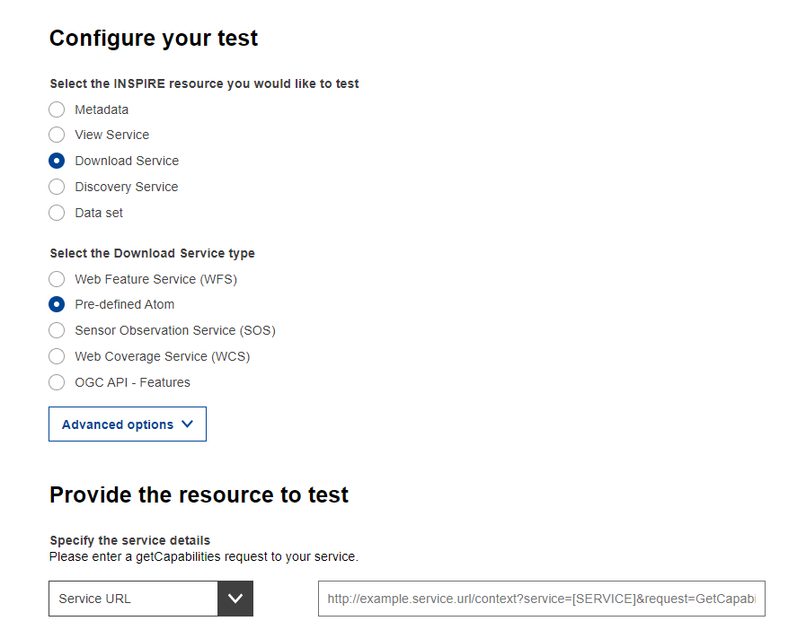

# Cookbook Webdav Atom

In the [technical Guidelines download services](https://inspire.ec.europa.eu/documents/technical-guidance-implementation-inspire-download-services) `INSPIRE atom services` are described to provide a light weight alternative to WFS and WCS, while fitting with all the aspects of a `webservice` as described in the implementing rules.

Some solutions like GeoNetwork and Hale Connect provide Atom services as part of their publication process. But it is also possible to place a number of Atom-xml files along side the downloadable resources in a web accessible folder or webdav. 

This cookbook describes a minimal approach to set up a webdav to disseminate some datasets.

## WSGIDAV

Various webdav implmentations exist; [apache webdav](https://httpd.apache.org/docs/2.4/mod/mod_dav.html), [NGINX DAV](https://nginx.org/en/docs/http/ngx_http_dav_module.html), [SFTPGO](https://github.com/drakkan/sftpgo), [wsgidav](https://wsgidav.readthedocs.io/). For this cookbook we'll use wsgidav, but others will work a similar way.

WsgiDAV provides a docker image, with below statement you advertise the current folder via WebDAV.

```
docker run --rm -it -p 8080:8080 -v $(PWD):/var/wsgidav-root mar10/wsgidav
```

Open http://localhost:8080 in your browser to see the file contents.

## ATOM files

Stop the container (ctrl-C). Create a new folder and copy your dataset(s) of choice into it. Create a file service.atom and for each dataset a new text file with the same name, but the atom extension.

Service.atom is the `service feed` (comparable to the capabilities operation in OWS). The service feed will contain details about the service and link to each of the dataset feeds. Populate the service feed with (replace relevant sections):

```xml
<feed xmlns="http://www.w3.org/2005/Atom"
  xmlns:georss="http://www.georss.org/georss" 
  xmlns:inspire_dls="http://inspire.ec.europa.eu/schemas/inspire_dls/1.0" 
  xml:lang="en">
 <!-- feed title -->
 <title>XYZ Example INSPIRE Download Service</title>
 <!-- feed subtitle -->
 <subtitle>INSPIRE Download Service of Soil Properties data in Sahel region</subtitle>
 <!-- self-referencing link to this feed -->
 <link href="http://localhost:8080/service.atom" rel="self" type="application/atom+xml"  hreflang="en" title="This document"/>
 <!-- link to Open Search definition file for this servicen (not implemented) 
<link rel="search" href="http://example.com/search/opensearchdescription.xml" type="application/opensearchdescription+xml" title="Open Search Description for XYZ download service"/> -->
 <!-- identifier -->
 <id>http://localhost:8080/service.atom</id>
 <!-- rights, access restrictions -->
 <rights>Copyright (c) 2021, XYZ; all rights reserved</rights>
 <!-- date/time this feed was last updated -->
 <updated>2021-03-31T13:45:03Z</updated>
 <!-- author contact information -->
 <author><name>John Doe</name><email>doe@example.com</email></author>
 <category term="http://inspire.ec.europa.eu/metadata-codelist/SpatialDataServiceCategory/infoFeatureAccessService" scheme="http://inspire.ec.europa.eu/metadata-codelist/SpatialDataServiceCategory"/>
 <!-- entry for a "Dataset Feed" for a pre-defined dataset -->
 <entry>
    <!-- title for "Dataset Feed" for pre-defined dataset -->
    <title>soil properties ABC Dataset Feed</title>
    <!-- Spatial Dataset Unique Resource Identifier for this dataset-->
    <inspire_dls:spatial_dataset_identifier_code>wn_id1</inspire_dls:spatial_dataset_identifier_code> 
    <inspire_dls:spatial_dataset_identifier_namespace>http://example.com/</inspire_dls:spatial_dataset_identifier_namespace>
    <!-- link to dataset metadata record -->
    <link href="http://example.com/metadata/abcISO19139.xml" rel="describedby" type="application/xml"/>
    <!-- link to "Dataset Feed" for pre-defined dataset -->
    <link rel="alternate" href="http://localhost:8080/soilproperties_feed.atom" type="application/atom+xml"  hreflang="en" title="Feed containing the soil properties data"/>
    <!-- identifier for "Dataset Feed" for pre-defined dataset -->
    <id>http://localhost:8080/soilproperties_feed.atom</id>
    <!-- rights, access info for pre-defined dataset -->
    <rights>Copyright (c) 2002-2021, XYZ; all rights reserved</rights>
    <!-- last date/time this entry was updated -->
    <updated>2012-03-31T13:45:03Z</updated>
    <!-- summary -->
    <summary>This is the entry for soil properties ABC Dataset</summary>
    <!-- optional GeoRSS-Simple polygon outlining the bounding box of the pre-defined dataset described by the entry. Must be lat lon -->
    <georss:polygon>47.202 5.755 55.183 5.755 55.183 15.253 47.202 15.253 47.202 5.755</georss:polygon>
    <!-- CRSs in which the pre-defined Dataset is available -->
    <category term="http://www.opengis.net/def/crs/EPSG/0/4258" label="ETRS89"/>
 </entry>
</feed>
```

Notice that we're not implementing the actual opensearch search functionality yet. You can leave the `opensearchdescription` line empty for now. There are some external options to provide the opensearch, the Technical Guidance document actually includes a PHP script to facilitate opensearch.

Then for each dataset add a file `soilproperties_feed.atom`:

```xml
<feed xmlns="http://www.w3.org/2005/Atom"
 xmlns:georss="http://www.georss.org/georss" xml:lang="en">
    <!-- feed title -->
    <title>INSPIRE Dataset Soil properties Download</title>
    <!-- feed subtitle -->
    <subtitle>INSPIRE Download Service, of organisation XYZ providing dataset Soil Properties</subtitle>
    <!-- links to INSPIRE Spatial Object Type definitions for this predefined dataset -->
    <link href="https://inspire.ec.europa.eu/featureconcept/SoilProfile" rel="describedby" type="text/html"/>
    <!-- self-referencing link to this feed -->
    <link href="http://localhost:8080/soilproperties_feed.atom" rel="self" 
    type="application/atom+xml"
    hreflang="en" title="This document"/>
    <!-- upward link to the corresponding download service feed -->
    <link href="http://localhost:8080/service.atom" rel="up" type="application/atom+xml" hreflang="en" title="The parent service feed document"/>
    <!-- identifier -->
    <id>http://localhost:8080/soilproperties_feed.atom</id>
    <!-- rights, access restrictions -->
    <rights>Copyright (c) 2021, XYZ; all rights reserved</rights>
    <!-- date/time this feed was last updated -->
    <updated>2021-03-31T13:45:03Z</updated>
    <!-- author contact information -->
    <author><name>John Doe</name><email>doe@xyz.org</email></author>
    <!-- download the pre-defined dataset in GML format in CRS EPSG:25832 --> 
    <entry>
        <title>soil properties in CRS EPSG:25832 (GML)</title>
        <link rel="alternate" href="http://localhost:8080/soilproperties_25832.gml" type="application/gml+xml;version=3.2" hreflang="en" length="34987" 
          title="soil properties dataset encoded as a GML 3.2 document in ETRS89 UTM zone 32N (http://www.opengis.net/def/crs/EPSG/0/25832)"/>
        <id>http://localhost:8080/soilproperties_25832.gml</id>
        <updated>2021-06-15T11:12:34Z</updated>
        <category term="http://www.opengis.net/def/crs/EPSG/0/25832" label="ETRS89 / UTM zone 32N"/>
    </entry>
    <!-- download the same pre-defined dataset in GML format in CRS EPSG:4258-->
    <entry>
        <title>soil properties in CRS EPSG:4258 (GML)</title>
        <!--file download link-->
        <link rel="alternate" href="http://localhost:8080/soilproperties_WGS84.gml" type="application/gml+xml;version=3.2" hreflang="en" length="37762" 
          title="soil properties encoded as a GML 3.2 document in WGS84 geographic coordinates (http://www.opengis.net/def/crs/OGC/1.3/CRS84)"/>
        <id>http://localhost:8080/soilproperties_WGS84.gml</id>
        <updated>2021-06-14T12:22:09Z</updated>
        <category term="http://www.opengis.net/def/crs/EPSG/0/4258" label="ETRS89"/>
    </entry>
    <!-- download the same pre-defined dataset in ShapeFile format in CRS EPSG:25832, ShapeFile is in a single zip archive.-->
    <entry>
        <title>soil properties in CRS EPSG:25832 (ShapeFile)</title>
        <link rel="alternate" href="http://localhost:8080/soilproperties_25832.zip" type="application/xshapefile" hreflang="en" length="89274" 
        title="soil properties dataset encoded as a ShapeFile in ETRS89 UTM zone 32N (http://www.opengis.net/def/crs/EPSG/0/25832)"/>
        <id>http://localhost:8080/soilproperties_25832.zip</id>
        <updated>2021-06-15T11:12:34Z</updated>
        <category term="http://www.opengis.net/def/crs/EPSG/0/25832" 
        label="ETRS89 / UTM zone 32N"/>
    </entry>
</feed>
```

Notice that you can provide multiple distributions for the same dataset (in various projections, translations or formats) to facilitate users.

Notice that the examples above incorperate ongoing work as described in https://github.com/INSPIRE-MIF/gp-data-service-linking-simplification/issues/63.

The docker container runs locally, so it can not be tested by the [INSPIRE Validator](https://inspire.ec.europa.eu/validator/test-selection/index.html). A workaround exists; you can use [localtunnel](https://theboroer.github.io/localtunnel-www/) (requires nodejs), [ngrok](https://ngrok.com) (requires registration) or [localhost.run](https://localhost.run) to provide a temporal web address to your local server. Note that you have to update the self-references in atom files to use the tunneled web address. Then trigger the Atom validation:



