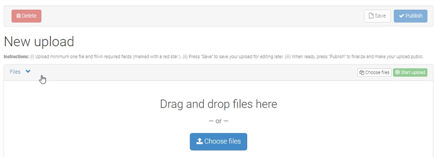
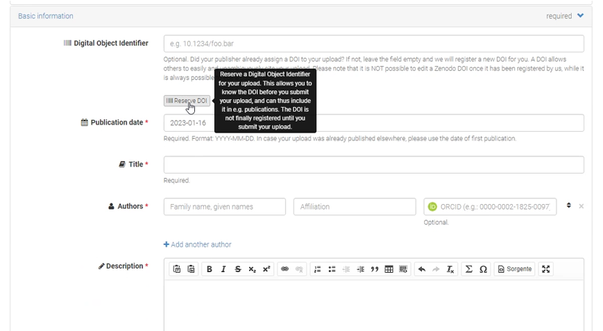
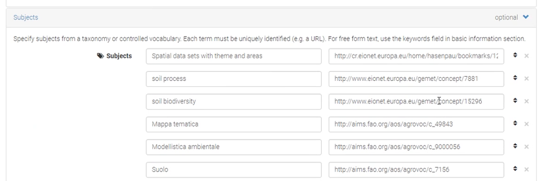

# Zenodo

This recipe proposes an approach to use [Zenodo](https://zenodo.org) to publish a dataset in such a way, that many of the INSPIRE practices are implemented. 
Zenodo is a generic repository for academic work part of the European OpenAIRE program and operated by CERN. 
Zenodo resources are clustered in communities. You can join an existing community or start one. Resources from a community can be accessed as a collection.
Community moderators (dis)allow contributions to a community.

## DataCite & INSPIRE

Zenodo adopted aspects of the [DataCite metadata schema](https://schema.datacite.org/). The procedure below is also relevant for other DataCite oriented repositories, such as [Dataverse](https://dataverse.org). Since Zenodo is DataCite oriented, it does not directly match the requirement of INSPIRE to provide iso19139 metadata. However by following the suggested procedure, the metadata is almost semantically identical. Two routes of resolving this challenge are possible:

- Engage with the INSPIRE community to enable the DataCite encoding as an additional format to provide INSPIRE metadata
- Introduce a technical component, such as [pygeometa](./pygeometa.md), which could provide a transformation from DataCite to iso19139

Clement Lattelais (INRAE) is preparing a [comparison tool](https://creagov.sharepoint.com/:p:/r/sites/EJP-SOILWP6INSPIREWG/Documenti%20condivisi/General/task6.1/task6.1_metadata/EJP%20SOIL_JRC_metadata%20catalog%20meeting_nov%202022.pptx?d=w3ed829c3137b4e36a1e169b7f2ffd4a8&csf=1&web=1&e=NfJAaV) on how the metadata schemes of various repositories (DataVerse, Zenodo, ..) relate to the INSPIRE Metadata Guidelines. This tool is relevant to evaluate if (and how) a certain repository can be used for INSPIRE. But also to assess any non listed repositories.

## Upload your data to Zenodo

After (registering and) logging in you can select the upload resource option.

In the next step a metadata form opens starting with the obvious fields, title, abstract, keywords, publication date. Notice that an existing DOI can be provided or a new one be generated by the platform.

The list of contact roles is very detailed in Zenodo. Verify that you have at least 1 contact which has the role of `Contact point`, and provide at least a valid email address.

INSPIRE metadata guidelines mandate a number of fields which are not available on the Zenodo metadata form. There are 2 options to still provide this metadata. 

- Provide a iso19139 document as an additional attachement to the record.
- Use the subject field to provide additional metadata

For option 2, the relevant element is the subject area at the bottom of the metadata form. Each subject is defined by a label and a URI. These URI's can reference concepts which provide the required context to the data. The table below suggests a number of subjects to be added, related to specific metadata requirements

| Requirement | Thesaurus | Example |
| --- | --- | --- |
| Topic category | [TopicCategory](https://inspire.ec.europa.eu/metadata-codelist/TopicCategory) | [geoscientific Information](https://inspire.ec.europa.eu/metadata-codelist/TopicCategory/geoscientificInformation) |
| Conditions applying to access and use | [ConditionsApplyingToAccessAndUse](https://inspire.ec.europa.eu/metadata-codelist/ConditionsApplyingToAccessAndUse) | [no Conditions Apply](https://inspire.ec.europa.eu/metadata-codelist/ConditionsApplyingToAccessAndUse/noConditionsApply) |
| Geographic bounding box | [GeoNames](http://geonames.org) | [Italy](https://www.geonames.org/3175395/italian-republic.html) |
| INSPIRE Theme | [Theme register](https://inspire.ec.europa.eu/theme) | [Soil](https://inspire.ec.europa.eu/theme/so) |
| Priority dataset | [Priority dataset](https://inspire.ec.europa.eu/metadata-codelist/PriorityDataset) | [Directive 2008/56/EC](http://inspire.ec.europa.eu/metadata-codelist/PriorityDataset/dir-2008-56) |
| Degree of conformity | [Degree of conformity](https://inspire.ec.europa.eu/metadata-codelist/DegreeOfConformity) | [Not evaluated](http://inspire.ec.europa.eu/metadata-codelist/DegreeOfConformity/notEvaluated) |
| IACS Data | [IACS Data](https://inspire.ec.europa.eu/metadata-codelist/IACSData)| [lpis](https://inspire.ec.europa.eu/metadata-codelist/IACSData/lpis) |
| Spatial Data Service Type | [Spatial Data Service Type](https://inspire.ec.europa.eu/metadata-codelist/SpatialDataServiceType) | [View service](http://inspire.ec.europa.eu/metadata-codelist/SpatialDataServiceType/view) |
| Spatial Scope | [Spatial Scope](https://inspire.ec.europa.eu/metadata-codelist/SpatialScope) | [Regional](http://inspire.ec.europa.eu/metadata-codelist/SpatialScope/regional) |

## An Atom approach to access the data on Zenodo

This approach is based on the [recipe on WebDav and Atom services](./webdav.md). The suggestion is to upload 2 additional Atom.xml files which describe the resources in an Atom format. The first file describes the Atom Download Service. The second Atom describes the distributions of the dataset. The zenodo approach will not cover all the aspects of a INSPIRE ATOM Download service, the OpenSearch option is missing. 

